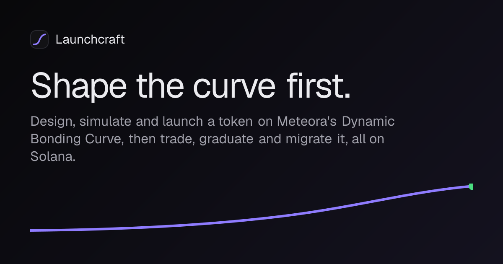
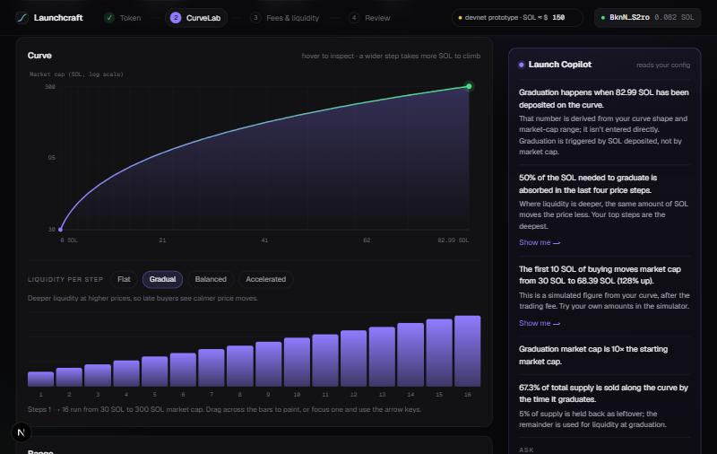
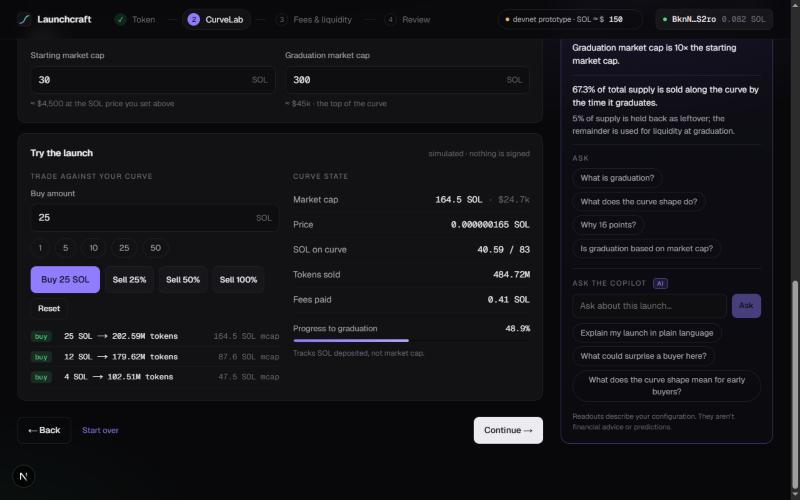
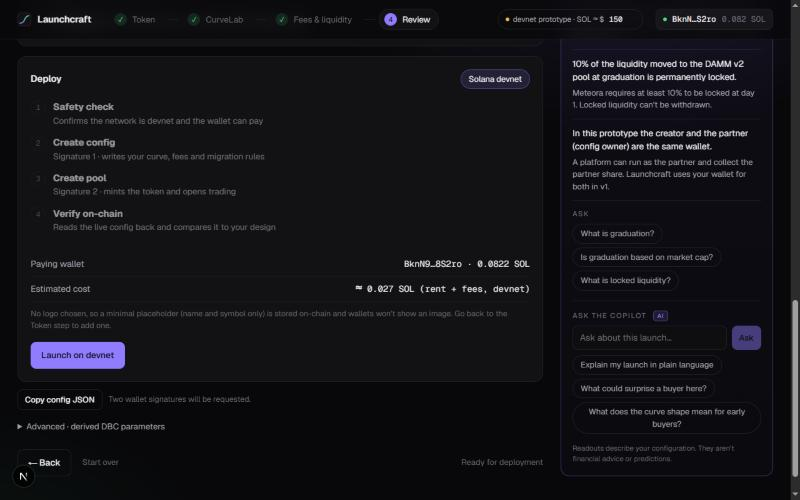
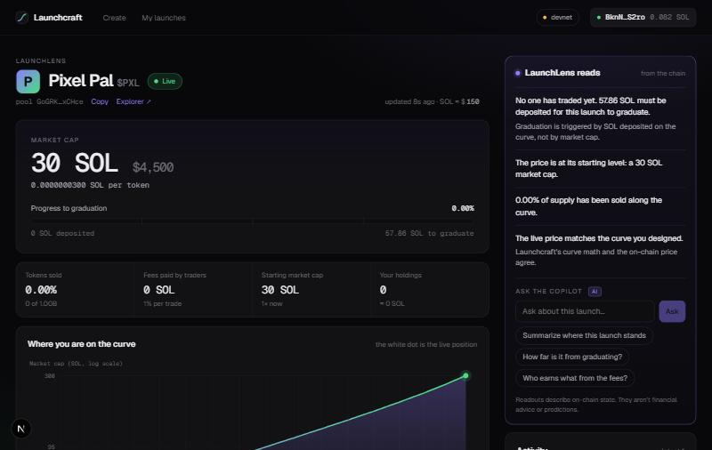
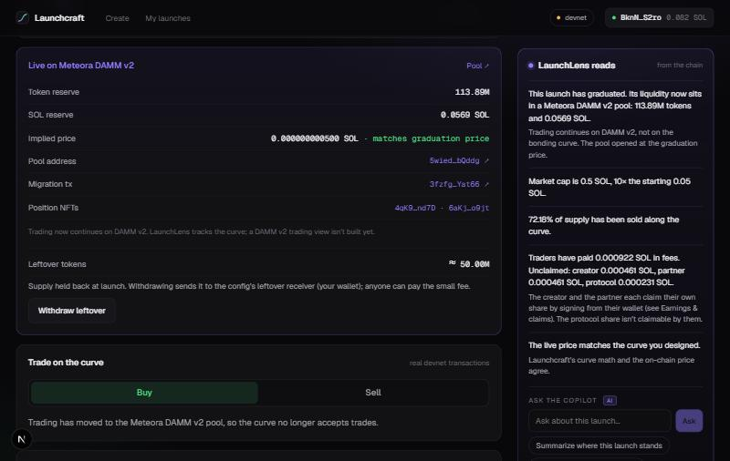
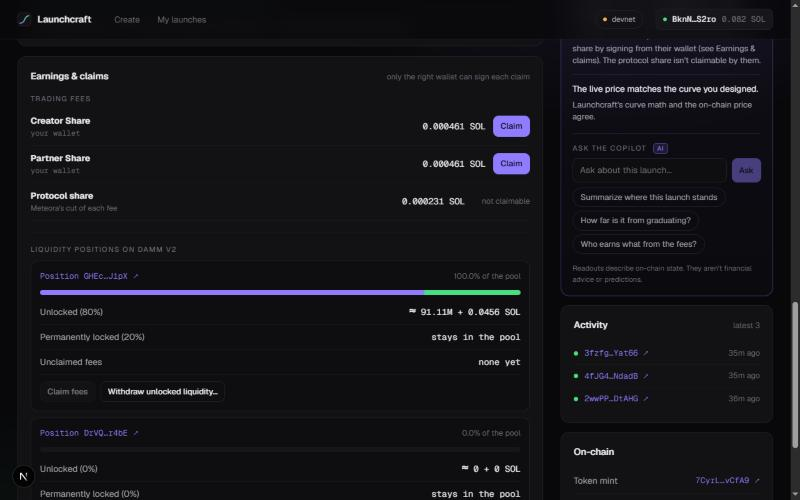
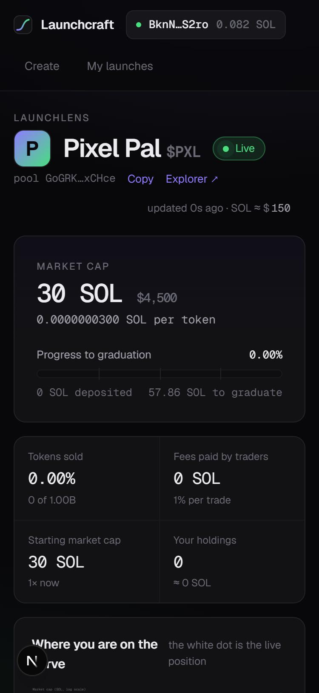
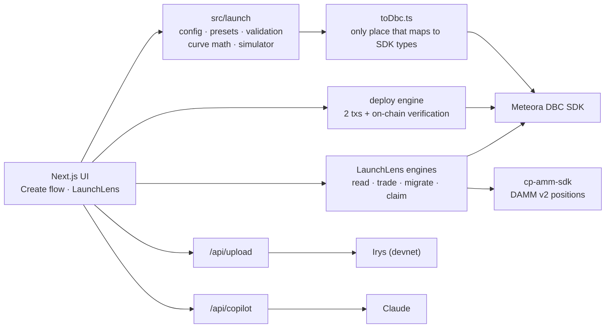

<p align="center">
  
</p>

# Launchcraft

**Design it. Simulate it. Launch it.** A visual launch studio for [Meteora's Dynamic Bonding Curve](https://docs.meteora.ag/) (DBC) on Solana.

Launching on a bonding curve normally means filling in a configuration file and hoping the economics come out right. Launchcraft turns that into a product: you **shape the price-discovery curve** by painting liquidity, **simulate real trades** against it before anything is signed, get **plain-language explanations** of what your configuration does, **deploy it on-chain**, then **watch, trade, graduate, migrate and claim**, all in one app. Every number comes from the real Meteora SDK and program, and every step has been run on Solana devnet.

> Hackathon: Meteora DBC track (Superteam Earn / Solana Global Hackathon). Status: working end to end on **devnet**. See [Proven on devnet](#proven-on-devnet) and [Limitations](#limitations).

## The loop

| | |
|---|---|
| **1. Design** | **CurveLab**: a log-scale curve chart over 16 draggable liquidity bars, with Flat / Gradual / Balanced / Accelerated presets. Drag across the bars to paint your own shape; the graduation target is recomputed live. <br> |
| **2. Simulate** | Buy and sell against your curve before deploying. Progress tracks **SOL deposited**, not market cap, because that is what actually triggers graduation. <br> |
| **3. Understand** | **Launch Copilot**: deterministic readouts computed from the real curve math ("50% of the SOL needed to graduate is absorbed in the last four steps", with a *Show me* highlight), plus optional free-form AI questions. |
| **4. Launch** | Two transactions put your config and pool on-chain, then the app reads the live config back and confirms it matches your design. A logo and description upload first, before any SOL is spent. <br> |
| **5. Observe and trade** | **LaunchLens** polls any devnet DBC pool: price, market cap, graduation progress, fees, activity, your holdings, and a live dot on the designed curve. Real buys and sells with quotes from the pool's live accounts. <br> |
| **6. Graduate, migrate, claim** | When the curve completes, anyone can migrate it to a **Meteora DAMM v2** pool in one transaction. Creators and partners claim fees and manage their liquidity positions. <br> <br> |

It also works on a phone: 

## How it uses Meteora

| Capability | SDK calls | Where |
|---|---|---|
| Build a curve from a visual shape | `buildCurveWithLiquidityWeights` | `src/launch/toDbc.ts` |
| Pre-launch trade quotes | `getQuoteFromInputAmount` (cross-checks our own curve math) | `src/launch/sdkQuote.ts`, tests |
| Deploy | `partner.createConfig`, `creator.createPool` | `src/deploy/deploy.ts` |
| Read pools and configs | `state.getPool`, `getPoolConfig`, `getPoolMigrationQuoteThreshold` | `src/lens/read.ts` |
| Live trading | `pool.swapQuote2`, `pool.swap2` (`PartialFill` for buys) | `src/lens/trade.ts` |
| Graduate to DAMM v2 | `migration.migrateToDammV2`, `withdrawLeftover` | `src/lens/migrate.ts` |
| Claim trading fees | `creator.claimCreatorTradingFee`, `partner.claimPartnerTradingFee` | `src/lens/claim.ts` |
| DAMM v2 positions | `@meteora-ag/cp-amm-sdk`: `getUserPositionByPool`, `getUnClaimLpFee`, `claimPositionFee`, `removeAllLiquidity` | `src/lens/positions.ts` |

## Proven on devnet

Everything below was done through this app (or the same engines headless) against the real Meteora programs. The landing page links the artifacts; `npm run doctor` re-checks that they still resolve.

| Step | Result |
|---|---|
| Quote vs reality | The preview matched the real buy and sell exactly (0% off). Our curve math matched the on-chain price to ~1e-14%, including after trades. |
| Deploy | Config plus pool in two transactions (about 0.027 SOL); the live graduation threshold matched the design exactly. |
| Logo | A 12,339-byte PNG uploaded to Irys. The URI stored on the token's mint serves the exact metadata JSON and image bytes a wallet or explorer would fetch, and LaunchLens renders it. (Not yet opened in a third-party wallet.) |
| Graduate | One `PartialFill` buy took a pool to exactly 100% of its threshold; afterwards the program rejects every trade ("Pool is completed"). |
| Migrate | DAMM v2 pool opened at **exactly the graduation price**. Planned vs actual: 227,784,041.25 vs 227,784,041.08 tokens, 0.113891969 vs 0.113891969 SOL. About 0.024 SOL, one signature, permissionless. |
| Fees | The fee splits 20% protocol / 40% creator / 40% partner at the 1% default. Claiming drops the on-chain counters to 0 and the wallet gains the amount less transaction fees. |
| Positions | Creator 50% unlocked; partner 40% unlocked + 10% permanently locked, as configured. Withdrawing unlocked liquidity returned the SOL the UI estimated, to within fees; the locked share stayed. |

### Things we learned about DBC (confirmed on-chain)

- The curve is always **16 geometric price steps**, edited as 16 liquidity weights; the SOL needed to graduate is **derived** from the shape, not an input.
- **At least 10%** of migrated liquidity must be locked at day 1, and the four liquidity shares must sum to 100.
- A 16-point config plus pool creation exceeds Solana's 1232-byte limit, so deployment is **two transactions**.
- Weighted curves need a `leftover` token buffer (the app defaults to 5%).
- The migration fee (20 bps on devnet) comes out of **both** the tokens and the SOL.
- `swapQuote2` expects the pool in the wrapped `{ poolState }` shape that `getPool` returns.

## Quick start

```bash
npm install
npm run dev          # http://localhost:3100  (landing)  and /create  (the flow)
```

Open `/create`, press **Fill with an example**, and walk the four steps. Pick **Burner wallet (devnet)** to get a throwaway key stored in your browser, then fund it from [faucet.solana.com](https://faucet.solana.com). Deploying costs about 0.027 SOL. The default curve needs ~58 SOL of buying to graduate, which the faucet can't cover, so to see the whole lifecycle use a small curve (for example start 0.05, graduation 0.5 SOL market cap, a ~0.11 SOL threshold): about 0.2 SOL then covers launch, graduate and migrate.

| Command | What |
|---|---|
| `npm test` | 58 tests: validation, curve math cross-checked against the SDK, deploy safety, claims, uploads, the AI prompt layer |
| `npm run typecheck` | strict TypeScript |
| `npm run doctor` | read-only pre-flight: devnet RPC, wallet balances, optional keys, proof links |
| `npm run build` | production build |

### Optional configuration

Copy `.env.example` to `.env.local`. Everything is optional.

- `ANTHROPIC_API_KEY`: enables the **Ask the Copilot** box. Without it the rule-based Copilot still works and the box explains how to enable AI answers.
- Logo upload uses a small server-side wallet (`.keys/uploader.json`, created with `npx tsx spike/new-key.ts uploader`, funded with ~0.03 devnet SOL) that pays about 0.00004 SOL per upload on Irys devnet. Or paste your own metadata URI.
- `NEXT_PUBLIC_RPC_URL`: a steadier devnet RPC (it **must** be devnet; see below).

## How it's built



| Path | What |
|---|---|
| `src/launch/` | The product core: `LaunchConfig`, presets, validation, pure curve math, the simulator. Imports no Meteora types except `toDbc.ts`. |
| `src/deploy/` | The two-transaction deploy, devnet guard, deployment records. |
| `src/lens/` | LaunchLens engines: reading, trading, migration, claims, positions. |
| `src/copilot/` | Rule-based readouts, the AI prompt layer, the context builders. |
| `src/upload/` | Image sniffing, metadata JSON, Irys storage. |
| `src/components/` | The UI: CurveLab, simulator, steps, LaunchLens panels. |
| `spike/` | Scripts that proved each SDK path on devnet, plus `doctor`, `fund`, `new-key` and the budget guard. |

## Safety and trust

- **Devnet only, enforced.** `assertDevnet` checks the RPC's genesis hash before any transaction; a non-devnet endpoint is refused, so no real SOL can be spent.
- **Verified on-chain.** After deploying, the live graduation threshold is read back and compared with the design. LaunchLens also flags if the live price drifts from the designed curve.
- **Nothing is spent on a failed upload.** The logo uploads first; a failure costs nothing. If the pool step fails after the config landed, *Retry* reuses the existing config.
- **Destructive actions confirm.** Withdrawing liquidity shows the amounts and the effect on traders first; the permanently locked share can never be withdrawn.
- **Uploads are checked by content,** not file name: PNG/JPEG/GIF/WebP up to 512 KB; SVG is refused.
- **The AI is grounded and injection-safe.** It only sees numbers Launchcraft computed; it gives no advice or predictions. Token names and descriptions are user- and chain-controlled, so they are length-capped, stripped of control characters, JSON-quoted, and `<` is escaped so no text can fake the end of the data block (tested).
- **Secrets stay out of git.** `.keys/` and `.env*` are ignored; `.env.example` documents the options.

## Devnet SOL budget

The public faucet only allows a request every few hours, so every spending script goes through `spike/_budget.ts`: it prints the planned spend and refuses to dip below a protected reserve (default 0.25 SOL for the main test wallet). Override with `LC_RESERVE_SOL`, or deliberately with `LC_BUDGET_OVERRIDE=1`. `spike/fund.ts <address> [sol]` moves devnet SOL through the same guard.

## Limitations

Honest list of what is **not** done or **not verified**:

- **Devnet only.** Mainnet would need real storage and RPC, a funded and secured uploader (or a user-paid upload), and a security review.
- **No trading on the migrated DAMM v2 pool** inside the app; LaunchLens shows its reserves and your positions, not a swap UI for it.
- **Not built:** surplus and migration-fee withdrawals (zero for Launchcraft pools, which stop exactly at the threshold); migration fee tiers other than 0.25% (the code supports options 0-6, only option 0 was exercised).
- **Not exercised live in this environment:** Phantom, Solflare and Backpack (no extension was available; the burner wallet was used throughout), and the AI answers (no API key; the prompt layer and streaming are covered by tests with a fake client, and the no-key path was checked against the running server).
- Rate limits are in-memory, which is fine for one server but not for a fleet.
- Solana can reset devnet, which would expire the proof links.

## More

- [`docs/DEMO.md`](docs/DEMO.md): a 4-minute walkthrough script and pre-flight checklist.
- [`docs/DEPLOY.md`](docs/DEPLOY.md): deploy to Vercel, with the exact environment variables, plus `npm run smoke` to test the live URL.
- [`docs/SUBMISSION.md`](docs/SUBMISSION.md): the write-up for the hackathon listing.
